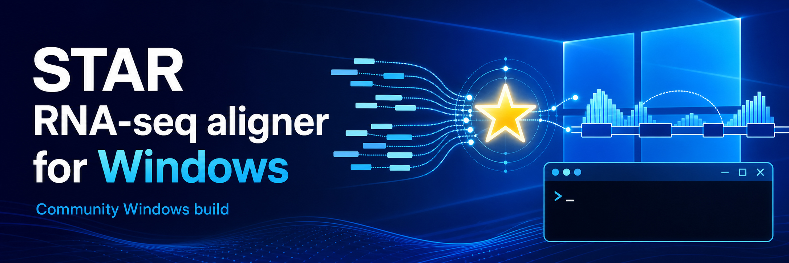

# STAR RNA-seq aligner for Windows

Community Windows build of the STAR RNA-seq aligner.

This repository provides a STAR build that runs on Windows.
The release archive includes `STAR.exe`, `STARlong.exe`, and all required MSYS2-MSYS runtime DLLs, so Windows users can use STAR
without building it from source.

This is **not an official STAR release**.  
Official STAR repository: https://github.com/alexdobin/STAR

This build is based on upstream STAR 2.7.11b.

This repository provides Windows executables for:

- `STAR.exe` for standard short-read alignment
- `STARlong.exe` for long-read alignment

built using [**MSYS2 MSYS**](https://www.msys2.org/docs/environments/).

## Download STAR for Windows

Prebuilt Windows binaries are available from the
[Releases](https://github.com/tus-kondolab/star-windows-build/releases) page
of this repository.

Download the latest release archive, for example:

```text
STAR-2.7.11b-windows-x86_64-msys.zip
```

After extracting the archive, you should see:

```text
star/
  STAR.exe
  STARlong.exe
  msys-2.0.dll
  msys-z.dll
  msys-gcc_s-seh-1.dll
  msys-gomp-1.dll
  msys-stdc++-6.dll
  STAR-gz.ps1
  STARlong-gz.ps1
  THIRD_PARTY_NOTICES.txt
```

Keep the DLL files in the same folder as `STAR.exe` and `STARlong.exe`.

## Run STAR from PowerShell

STAR is a command-line program. Open PowerShell, then move into the extracted
`star` folder before running STAR:

```powershell
# Replace this path with the folder where you extracted the ZIP file.
# For example:
cd C:\Users\your_name\Downloads\star
```

Check the version with:

```powershell
.\STAR.exe --version
.\STARlong.exe --version
```

Example short-read run:

```powershell
# Generate a genome index.
.\STAR.exe --runThreadN 8 `
  --runMode genomeGenerate `
  --genomeDir .\genome_index `
  --genomeFastaFiles .\reference.fa `
  --sjdbGTFfile .\annotation.gtf `
  --sjdbOverhang 100

# Map paired-end short reads.
.\STAR.exe --runThreadN 8 `
  --genomeDir .\genome_index `
  --readFilesIn .\reads_R1.fastq .\reads_R2.fastq `
  --outFileNamePrefix .\star_output\
```

## Working with gzipped input files

If your genome FASTA, annotation GTF, or FASTQ files are gzipped, use the
included PowerShell wrapper script, `STAR-gz.ps1` (or `STARlong-gz.ps1` for
STARlong). The wrapper temporarily decompresses `.gz` files listed after
`--genomeFastaFiles`, `--sjdbGTFfile`, or `--readFilesIn`, runs STAR with the
decompressed files, and removes the temporary files after STAR exits.
Non-gzipped files can be mixed with gzipped files; they are passed to STAR
unchanged.

```powershell
# Generate a genome index from gzipped and uncompressed input files.
.\STAR-gz.ps1 --runThreadN 8 `
  --runMode genomeGenerate `
  --genomeDir .\genome_index `
  --genomeFastaFiles .\reference.fa.gz .\extra_reference.fa `
  --sjdbGTFfile .\annotation.gtf.gz `
  --sjdbOverhang 100
```

```powershell
# Map paired-end gzipped short reads.
.\STAR-gz.ps1 --runThreadN 8 `
  --genomeDir .\genome_index `
  --readFilesIn .\reads_R1.fastq.gz .\reads_R2.fastq.gz `
  --outFileNamePrefix .\star_output\
```

Temporary decompressed files can be large. To place them on a specific drive,
use `-TempDir`:

```powershell
.\STAR-gz.ps1 -TempDir D:\star_tmp --runThreadN 8 `
  --genomeDir .\genome_index `
  --readFilesIn .\reads_R1.fastq.gz .\reads_R2.fastq.gz `
  --outFileNamePrefix .\star_output\
```

For long-read alignment, use `STARlong-gz.ps1` in the same way:

```powershell
.\STARlong-gz.ps1 --runThreadN 8 `
  --genomeDir .\genome_index `
  --readFilesIn .\long_reads.fastq.gz `
  --outFileNamePrefix .\starlong_output\
```

## Performance Reference

The following timings are from our validation environment and are provided as a
rough reference only. Actual runtime depends on the number of threads, storage
speed, STAR parameters, read length, and input data.

Validation environment:

- CPU: Intel Core i9-12900K
- Memory: 64 GB DDR4
- Storage: 2 TB SSD

Test data:

- Genome FASTA: `GRCh38.p14.genome.fa`
- Annotation GTF: `gencode.v49.primary_assembly.annotation.gtf`
- Mapping input: `SRR33370091` (~20 million reads, 150 bp paired-end)

Observed runtimes:

- Genome index generation for GRCh38: 50 minutes
- Mapping, including sorted-by-coordinate BAM output: 3 minutes 18 seconds

## Important Limitations

Do not use `--readFilesCommand` with this Windows release.

STAR handles compressed read input by running an external command such as
`zcat` or `gzip -cd` through `--readFilesCommand`, using FIFO files and
generated command scripts internally. This POSIX-style command pipeline is not
reliable in this MSYS2-MSYS Windows build.

Use `STAR-gz.ps1` instead. It works around this limitation by temporarily
decompressing gzipped input files before running `STAR.exe`. For long-read
alignment, use `STARlong-gz.ps1`.

STAR also expects genome FASTA files passed to `--genomeFastaFiles` and
annotation files passed to `--sjdbGTFfile` to be plain text. For `.fa.gz`,
`.fasta.gz`, `.gtf.gz`, `.fastq.gz`, or `.fq.gz` files, use `STAR-gz.ps1`,
`STARlong-gz.ps1`, or decompress the files manually before running STAR.

## Runtime DLLs included in the release archive

The release archive includes the following MSYS2-MSYS runtime DLLs:

```text
msys-2.0.dll
msys-z.dll
msys-gcc_s-seh-1.dll
msys-gomp-1.dll
msys-stdc++-6.dll
```

These DLLs are required to run the MSYS2-MSYS build of `STAR.exe` and `STARlong.exe` outside the MSYS2 environment.

The DLLs are redistributed unmodified from MSYS2 packages.

License information for these bundled DLLs is provided in
[THIRD_PARTY_NOTICES.txt](THIRD_PARTY_NOTICES.txt).

## Build from source

This section is for users who want to build `STAR.exe` and `STARlong.exe` themselves.

Install [**MSYS2**](https://www.msys2.org/), then open the **MSYS2-MSYS** terminal by selecting **MSYS2-MSYS** from the Windows Start menu.

Use the **MSYS2-MSYS** environment, **not MSYS2-UCRT64** or any other
MSYS2 environment.

Update MSYS2:

```bash
pacman -Syu
```

If MSYS2 asks you to close the terminal, close it, reopen **MSYS2-MSYS**, and run again:

```bash
pacman -Syu
```

Install the required build tools:

```bash
pacman -S --needed base-devel git gcc zlib-devel vim
```

`vim` provides `xxd`, which is required by the STAR Makefile.

Build both STAR and STARlong:

```bash
make
```

The build outputs and helper files will be copied to:

```text
win_x86_64/
  STAR.exe
  STARlong.exe
  STAR-gz.ps1
  STARlong-gz.ps1
  THIRD_PARTY_NOTICES.txt
```

Clean build outputs:

```bash
make clean
```

## MSYS2-MSYS build notes

The upstream STAR source does not build as-is in this MSYS2-MSYS setup because of two small compatibility issues.

First, the upstream Makefile uses:

```text
-std=c++11
```

This build changes it to:

```text
-std=gnu++11
```

This keeps C++11 support while enabling GNU extensions needed in this build environment.

Second, `SharedMemory.cpp` uses:

```cpp
SHM_NORESERVE
```

This macro is normally available on Linux, but may be undefined in MSYS2-MSYS.

This build passes the following option through STAR's `CXXFLAGSextra` variable:

```text
-DSHM_NORESERVE=0
```

This is equivalent to compiling with:

```cpp
#define SHM_NORESERVE 0
```

No direct edit is made to `SharedMemory.cpp`.

## What the Makefile does

The top-level `Makefile`:

1. copies `STAR/` to `build/STAR/`
2. copies `STAR/` to `build/STARlong/`
3. changes `-std=c++11` to `-std=gnu++11` in the copied Makefiles
4. passes `-DSHM_NORESERVE=0` via `CXXFLAGSextra`
5. builds `STAR` and `STARlong` separately
6. copies the final executables and helper files to `win_x86_64/`

Building `STAR` and `STARlong` in separate directories avoids mixing object files compiled with different build options.

## License

STAR is distributed under the MIT License.

This repository preserves the upstream STAR source and license.  
See the official STAR repository for the original source code and license information:

https://github.com/alexdobin/STAR

The release archive also includes MSYS2-MSYS runtime DLLs.  
See [THIRD_PARTY_NOTICES.txt](THIRD_PARTY_NOTICES.txt) for third-party package and license information.

## Disclaimer

This is a community build.

It is not provided, reviewed, or endorsed by the official STAR developers.  
Please verify the binaries and results in your own analysis environment.
